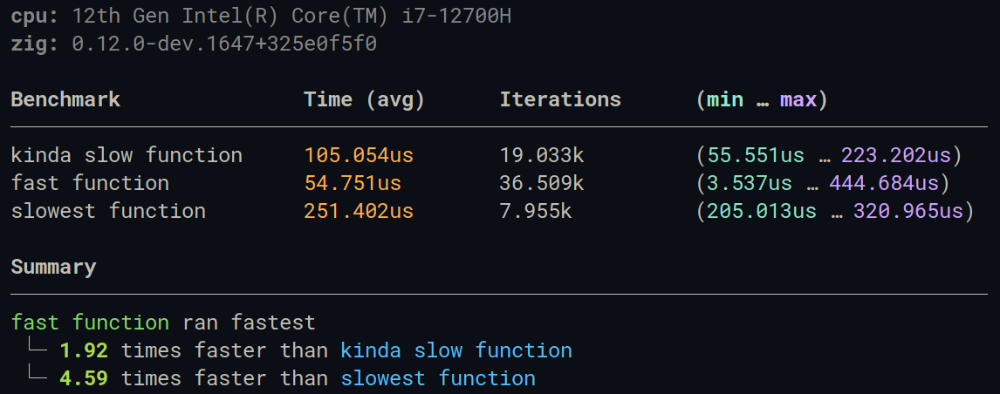

# zoop

A benchmarking library for zig.

- Uses built in monotonic, high performance timer.
- Warms up to remove function call overhead time.
- Supports lifecycle hooks like *beforeAll*, *afterEach*, etc.
- Can export raw benchmark data to JSON.
- Vibrant terminal output with easy to read data.
- Highly customizable.


## Installation

> Zig master version is required to use zoop.

To install zoop in your own project,

1. Add the dependency to the `build.zig.zon` of your project.

   ```zig
   .dependencies = .{
       .zoop = .{
           .url = "",
           .hash = "",
       },
   },
   ```

2. Add the dependency and module to your `build.zig`.

   ```zig
   const zoop_dep = b.dependency("zoop", .{});
   const zoop_mod = zoop_dep.module("zoop");
   exe.addModule("zoop", zoop_mod);
   ```

3. Import it inside your project.

   ```zig
   const Benchmark = @import("zoop").Benchmark;
   ```

or, if you just want to try out the benchmark from the above image, clone this repository and run `zig build run`.


## Documentation

> *CallbackFn* refers to the type `*const fn () anyerror!void`.

- ### Benchmark.init(allocator, config)

  Create a new Benchmark instance with the provided `config` options. (Provide `.{}` to use the default configuration.)

  ```zig
  var bench = Benchmark.init(allocator, .{});
  ```

  - `allocator`*(Allocator)*: The allocator to use inside the benchmark.
  - `config`*(struct)*: Configuration for the benchmark.
    - `show_cpu_name`*(bool)*: If true, shows the name of host device cpu. (Default is true)
    - `show_zig_version`*(bool)*: If true, shows the version of zig currently used to run the benchmark. (Default is true)
    - `show_summary`*(bool)*: If true, shows the summary after the entire benchmark is finished, i.e. the fastest test and comparison with other tests. (Default is true)
    - `show_summary_comparison`*(bool)*: If true, shows the comparison of the fastest test with the other tests else summary only displays the fastest test. (Default is true)
    - `show_output`*(bool)*: If false, no output is printed to stdout. (Default is true)
    - `enable_warmup`*(bool)*: If true, measures a [noop](https://en.wikipedia.org/wiki/NOP_(code)#JavaScript) function to calculate function call overhead which will be subtracted from results for more accurate data. (Default is true)
    - `iterations`*(u16)*: The maximum number of iterations to perform if the budget expires. (Default is 10)
    - `budget`*(u64)*: The maximum time (in nanoseconds) allotted to measure if the maximum iterations expire. (Default is 2 secs)
    - `hooks`*(struct)*: Hooks to execute during the benchmark lifecycle. (Defaults are noop)
      - `beforeAll`*(CallbackFn)*: Runs once before starting the benchmark.
      - `afterAll`*(CallbackFn)*: Runs once after finishing the benchmark.
      - `beforeEach`*(CallbackFn)*: Runs before measuring each test.
      - `afterEach`*(CallbackFn)*: Runs after measuring each test.
    - `export_json`*(?[]const u8)*: Exports the raw benchmark data in nanoseconds to the provided JSON file path. (Default is null)

- ### Benchmark.deinit()

  Release all allocated memory.

  ```zig
  defer bench.deinit();
  ```

- ### Benchmark.add(name: `[]const u8`, function: `CallbackFn`)

  Add a function to the test suite.

  ```zig
  try bench.add("my function", myFunction);
  // ...
  // ...
  fn myFunction() !void {
      // some code here to be measured
  }
  ```

- ### Benchmark.run()

  After adding all the tests, start the benchmark. (After finishing, results are sorted from fastest to slowest.)

  ```zig
  try bench.run();
  ```


Some of the internal functions are exposed for user's convenience.

- ### getCpuName(allocator)

  Returns the name of the host device cpu, such as `12th Gen Intel(R) Core(TM) i7-12700H`, `Apple M1 Max`, etc.

- ### fmtIntu32(u32_int)

  Returns a formatter which can convert u32 integers to short forms like 26.312k, 2.906M.


If you have any questions, feel free to join the discord server [here](https://discord.com/invite/tfBA2z8mbq).


## Credits

zoop is inspired from [hyperfine](https://github.com/sharkdp/hyperfine) and [mitata](https://github.com/evanwashere/mitata).


## License

This repository uses MIT License. See [LICENSE](https://github.com/tr1ckydev/zoop/blob/main/LICENSE) for full license text.
